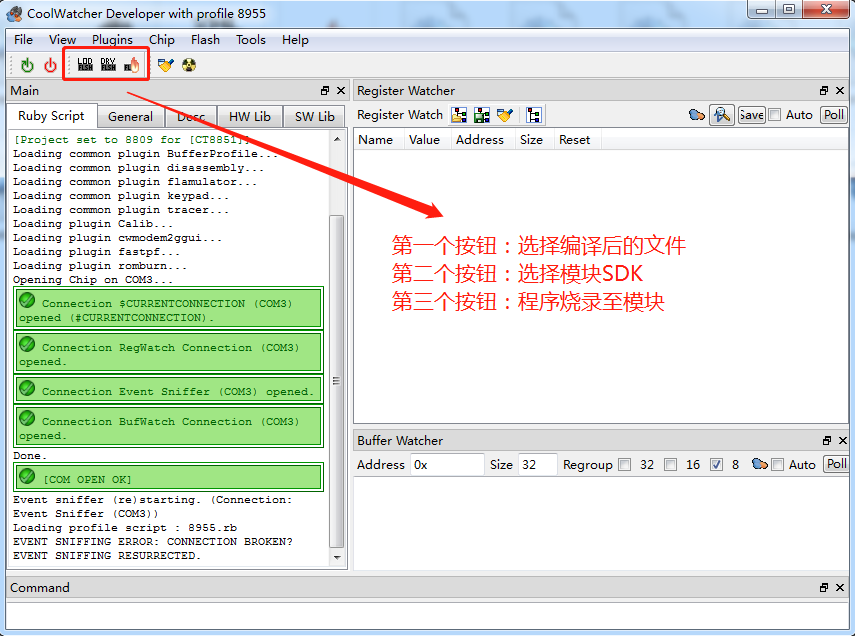

# 本文档宗旨意在记录操作过程中的指令

## 编译相关笔记

### 1、编译指令

- <code>build.bat app</code> 编译工程：编译app目录下的源码
- <code>build.bat demo $PROJ</code> 编译指定目录下的工程：比如./build.bat demo gpio
- <code>build.bat clean $PROJ</code> 清除$PROJ目录的中间文件
- <code>build.bat clean all</code> 清除所有中间文件

### 2、目录说明

编译会生成一个build目录，编译完成会在hex目录下生成两个格式为lod的文件，这就是我们用来下载到开发板的目标文件

两个文件一大一小，在第一次下载时需要下载大文件(*_B*.lod)即可，第二次和以后为了减少下载时间都只需要下载小文件(*_flash.lod)即可，更新SDK后需要重新下载大文件

## 程序写入笔记

### 1.操作软件：coolwatcher.exe
- 1-1 按钮说明:

~~~
其中，模块SDK指的是：platform\ramrun\flsh_spi32m\host_8955_flsh_spi32m_ramrun.lod
~~~

